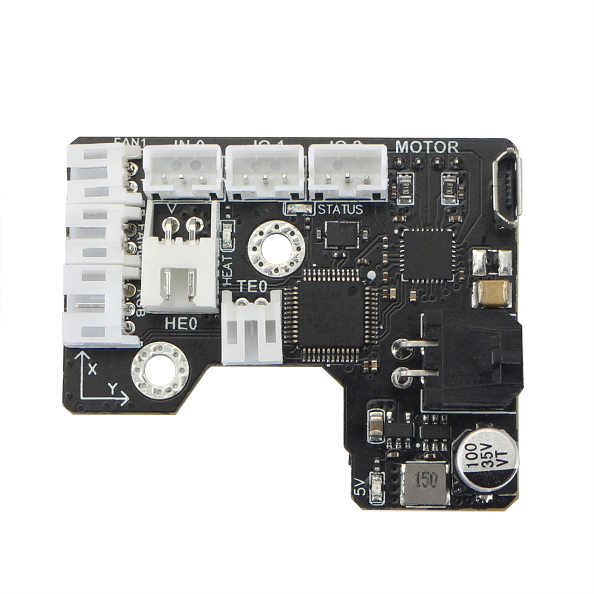

# Introduction

The SB CAN Tool Board is a highly integrated printhead control board. Based on STM32F072, running Klipper firmware. Onboard TMC2209 stepper motor driver, AXL345 acceleration sensor, and other necessary interfaces. And comes with a 2.5m 4-core cable for easy out-of-the-box use.

# Feature

- Based on STM32F072
- Onboard 1M CAN transceiver
- Onboard TMC2209
- 2x 0.5A MAX PWM interface for controllable fan (default VIN power supply, 5V optional)
- 1x signal input interface (VIN power supply, with level conversion)
- 2x signal input and output interface (5V power supply, with pull-up resistor)
- 1X 5V single wire RGB interface (1A MAX)
- 1x 4A MAX PWM output for heating rod
- 1x ADC interface for heating rod temperature acquisition
- MX3.0 2X2 interface for power and CAN signal access
- 1x Micro USB for firmware uploading
- Comes with 2.5m 4-core cable, 2x16AWG+2x24AWG
- Comes with terminal housing and wire crimping tabs

# Where to Buy

Taobao

Aliexpress

Official website

# Contact US

QQ group：1041794121

Facebook group：https://www.facebook.com/groups/197476557529090

Discord：https://discord.gg/Fb6FdND4

email：support@fysetc.com
